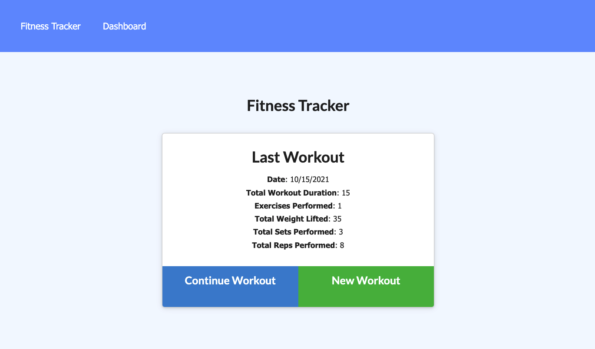
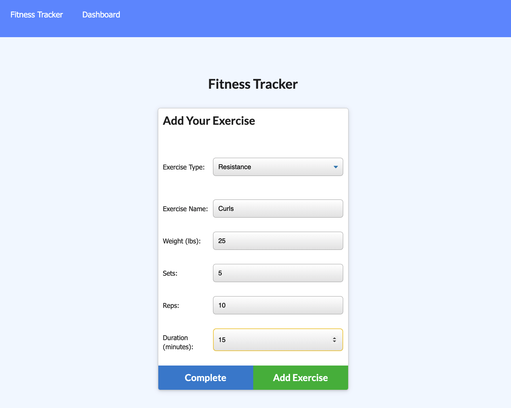
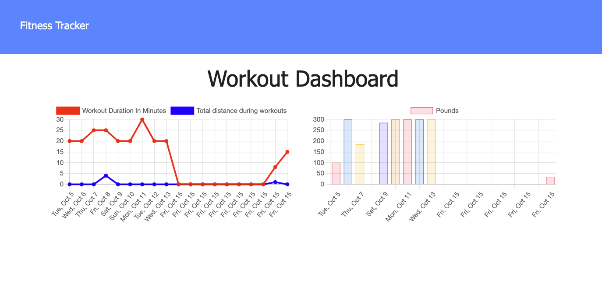

# NoSQL - Workout Tracker

# Table of Contents

  🔎 [Description](https://github.com/ChaseNicks/Workout_Tracker#Description)
  
  
  🔎 [Licenses](https://github.com/ChaseNicks/Workout_Tracker#Description)

  🔎 [Installation Intructions](https://github.com/ChaseNicks/Workout_Tracker#Installation-Instructions) 

  🔎 [Screenshots](https://github.com/ChaseNicks/Workout_Tracker#Screenshots)

  🔎 [Questions](https://github.com/ChaseNicks/Workout_Tracker#Questions)

# Description

 As a user, I want to be able to view create and track daily workouts. I want to be able to log multiple exercises in a workout on a given day. I should also be able to track the name, type, weight, sets, reps, and duration of exercise. If the exercise is a cardio exercise, I should be able to track my distance traveled.

# Licenses :

# Technologies

    * JavaScript
    * NoSQL
    * MongoDB
    * Mongoose
    * MongoDB Atlas
    * HTML / CSS
    * Express.js
    * Heroku
    * Node.js

# Installation Instructions

  1. Clone Repo
  2. Install Node.js
  3. Enter "npm i" into terminal for node_modules
  4. Enter "npm start"
  5. Copy and paste the URl given in the terminal

# Screenshots
 
 
 

# Questions

Github: [ChaseNicks](https://github.com/ChaseNicks)

Email: 📧chasenicks81@gmail.com

